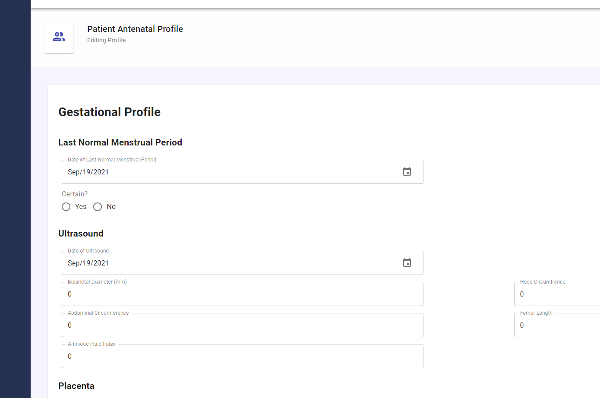

# Imhotech Solutions

  

We built a solution for maternal physicans in South Africa to quickly and effectively conduct their examinations

## HackMIT

This a a project built for HackMIT 2021 on the Healthcare track. We recieved the 5th place award for the InterSystems challenge! 

### Team Members:

- James Zhang ([jameszhang-a](https://github.com/jameszhang-a))

- Akshay Bodla ([AkBo24](https://github.com/AkBo24))

## Tech Stack

Front End: React, JavaScript, Material.UI

Back End: Node.js, Express.js, InterSystems® FHIR®

## Helpful Resources

- [InterSystems® FHIR® Accelerator for HackMIT 2021](https://mithack2021.isccloud.io/)
- [Intro to FHIR](https://www.youtube.com/watch?v=YbQcJj1GqH0)
- [FHIR: A Healthcare Data Standard Designed for the Future](https://www.youtube.com/watch?v=OIt0GrCPu8k)
